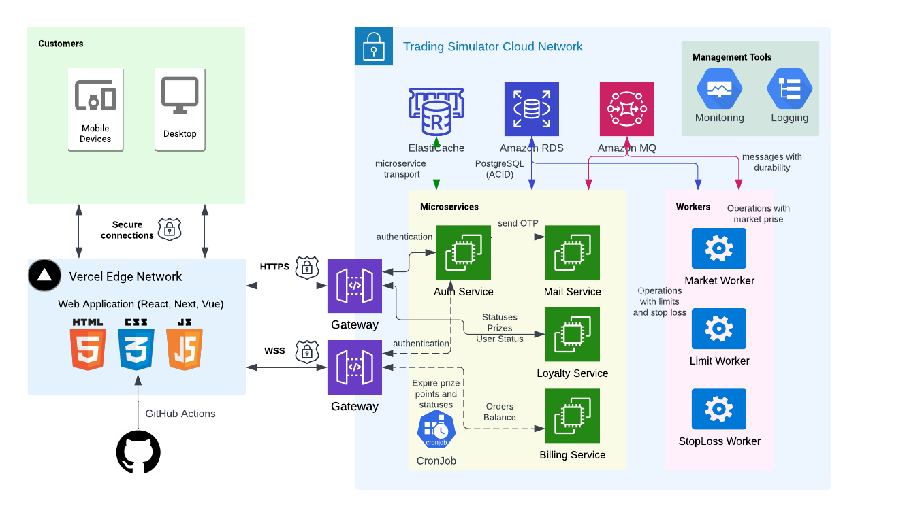

# Trading Simulator

## Description

It was created based on [Nest](https://nestjs.com/) framework.


### Architecture


The following diagrams show how the system works using the example of creating a new order

### Authentication (Auth Service)


### Create new order (Billing Service)


### Order processing  (Workers)


### Loyalty Status recalculation  (Loyalty Service)


## Installation

```bash
$ npm install
```

## Running the app
Before running the app, you need to create a .env file for each service in config/SERVICE_NAME. You can use the .env.local files as a template.

```bash
### Development mode
```bash
# start gateway
$ npm run start

# start auth service
$ npm run start:auth

# start billing service
$ npm run start:billing

# start loyalty service
$ npm run start:loyalty

# start mail service
$ npm run start:mail

# start market trading worker
$ npm run start:market

```

## Test

```bash
# unit tests
$ npm run test

# e2e tests
$ npm run test:e2e

# test coverage
$ npm run test:cov
```

## Stay in touch

- Author - [Viktor Plotnikov](https://www.linkedin.com/in/viktor-plotnikov-5289b165/)
